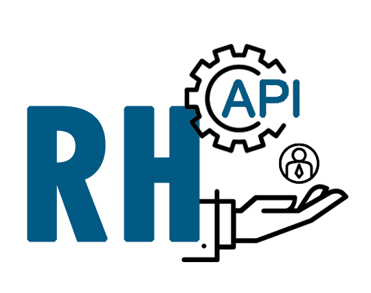
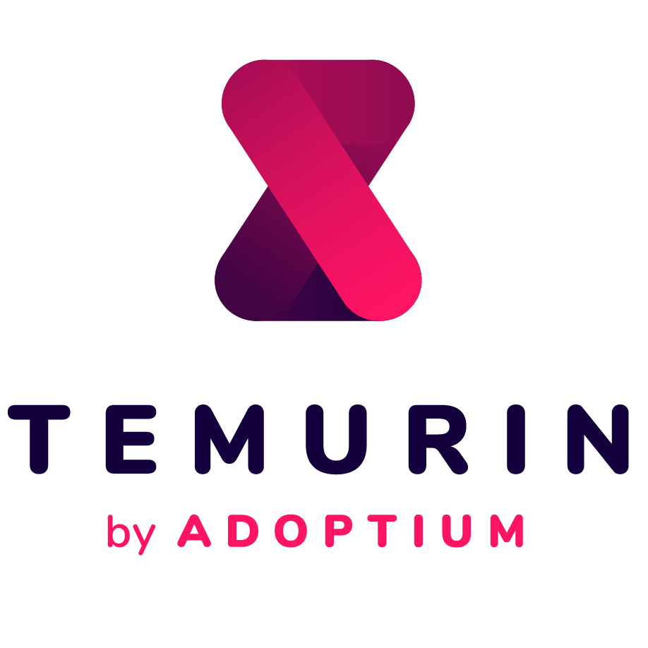
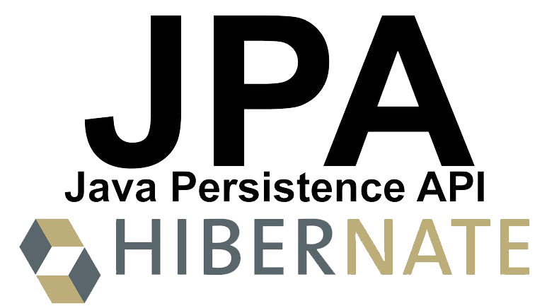

<p align="center">
  
</p>

# Rh_API

<h4 align="center"> 
	 Status: Concluded/ Under development.
</h4>

<br/>

**Human Resources simple CRUD API made during the Alga Works "Mergulho Java" event.**

---

<p align="center">
  <a href="#about">About</a> •
  <a href="#preview">Preview</a> •
  <a href="#tech-stack">Tech Stack</a> •
  <a href="#publication">Publication</a> •
  <a href="#author">Author</a> 
</p>

---

## About

Project developed as a result of the teachings learned at Mergulho Java, 2023, an Alga Works event.

A Backend API made using Java, Spring framework, Hibernate - Jakarta Persistense (JPA), and H2 in-memory Database, that allows you to create, list all and list, update or delete only one employee.

Insert and check employees: admission date, salary, status and email for contact.

**ATTENTION**:

> Because it is a in-memory Database, data will not persiste on disk, being lost everytime the application is refreshed.

## Preview

<h1 align="centetr">
	
</h1>

## Tech Stack and tools

<div style="display: inline_block"><br>
    
    
    
    
    
    
    
</div>

## Publication

<br/>

> Clone this repository!

- Make a clone of this repository:

  ```bash
  git clone git@github.com:Macedovin/rh_API.git
  ```

- Access the repository directory:

  ```bash
  cd rh_API.git
  ```

## Author

<br/>


Projeto criado pela [Alga Works](https://github.com/algaworks) e desenvolvido por [Vinicius&nbsp;Macedo](https://github.com/Macedovin).

<a href="mailto:macedo.vp@gmail.com" target="_blank"></a>&nbsp;
<a href="https://www.linkedin.com/in/vinicius-macedop/" target="_blank"></a>&nbsp;